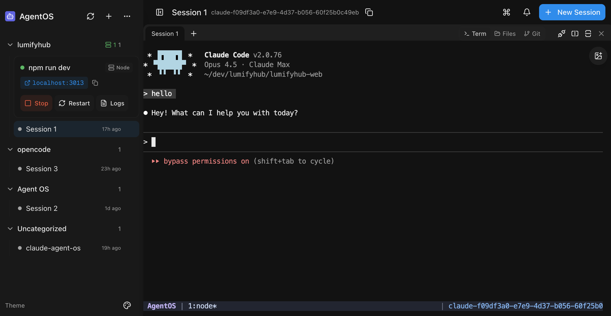

# AgentOS

A mobile-first web UI for managing AI coding terminals.

[](https://discord.gg/cSjutkCGAh)

https://github.com/user-attachments/assets/0e2e66f7-037e-4739-99ec-608d1840df0a



## Installation

### Via npm (Recommended)

If you already have Node.js 20+ installed:

```bash
# Install globally
npm install -g @saadnvd1/agent-os

# Run setup (checks/installs tmux, ripgrep, builds app)
agent-os install

# Start the server
agent-os start
```

### Via curl (Installs everything)

For fresh installs without Node.js:

```bash
curl -fsSL https://raw.githubusercontent.com/saadnvd1/agent-os/main/scripts/install.sh | bash
agent-os start
```

### Desktop App

Download native desktop apps from [Releases](https://github.com/saadnvd1/agent-os/releases):

- macOS (Apple Silicon): `.dmg`
- Linux: `.deb` or `.AppImage`

> **Note:** The desktop app is a native wrapper around the web UI. You still need to install and run AgentOS (via the installer script above) for the backend server. The desktop app just provides a convenient native window instead of using your browser.

> **Don't want to self-host?** Try [AgentOS Cloud](https://runagentos.com) - pre-configured cloud VMs for AI coding.

### Manual Install

```bash
git clone https://github.com/saadnvd1/agent-os
cd agent-os
npm install
npm run dev  # http://localhost:3011
```

### Prerequisites

- Node.js 20+
- tmux
- [ripgrep](https://github.com/BurntSushi/ripgrep) (for code search - auto-installed by installer script, or run `agent-os update`)
- At least one AI CLI: [Claude Code](https://github.com/anthropics/claude-code), [Codex](https://github.com/openai/codex), [OpenCode](https://github.com/anomalyco/opencode), or [Command Code](https://www.npmjs.com/package/command-code)

## Supported Agents

| Agent       | Resume | Fork | Auto-Approve                     |
| ----------- | ------ | ---- | -------------------------------- |
| Claude Code | ✅     | ✅   | `--dangerously-skip-permissions` |
| Codex       | ❌     | ❌   | `--approval-mode full-auto`      |
| OpenCode    | ❌     | ❌   | Config file                      |
| Command Code| ✅     | ✅   | `--yolo`                         |

## Features

- **Mobile-first** - Full functionality from your phone, not a dumbed-down responsive view
- **Voice-to-text** - Dictate prompts to your coding terminals hands-free
- **Multi-pane layout** - Run up to 4 terminals side-by-side
- **Code search** - Fast codebase search with syntax-highlighted results (Cmd+K)
- **File picker** - Browse and attach files to terminals, with direct upload from mobile
- **Clone from GitHub** - Clone repos directly from the UI when creating projects
- **Git integration** - Status, diffs, commits, PRs from the UI
- **Git worktrees** - Isolated branches with auto-setup
- **Dev servers** - Start/stop Node.js and Docker servers
- **Terminal orchestration** - Conductor/worker model via MCP

## CLI Commands

```bash
agent-os run       # Start and open browser
agent-os start     # Start in background
agent-os stop      # Stop server
agent-os status    # Show URLs
agent-os logs      # Tail logs
agent-os update    # Update to latest
```

## Mobile Access

Use [Tailscale](https://tailscale.com) for secure access from your phone:

1. Install Tailscale on your dev machine and phone
2. Sign in with the same account
3. Access `http://100.x.x.x:3011` from your phone

## Documentation

For configuration and advanced usage, see the [docs](https://www.runagentos.com/docs).

## Related Projects

- **[aTerm](https://github.com/saadnvd1/aTerm)** - A Tauri-based desktop terminal workspace for AI-assisted coding. While AgentOS is a mobile-first web UI, aTerm is a native desktop app with multi-pane layouts optimized for running AI coding agents (Claude Code, Aider, OpenCode) alongside shells, dev servers, and a built-in git panel. Choose AgentOS for mobile access and browser-based workflows, or aTerm for a native desktop terminal experience.
- **[LumifyHub](https://lumifyhub.io)** - Team collaboration platform with real-time chat and structured documentation. Useful alongside AgentOS for coordinating multi-agent work across a team — share terminal context, document architectural decisions from coding terminals, and track progress across parallel agent workflows.

## License

MIT License - Free and open source.

See [LICENSE](LICENSE) for full terms.
